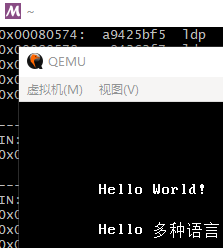
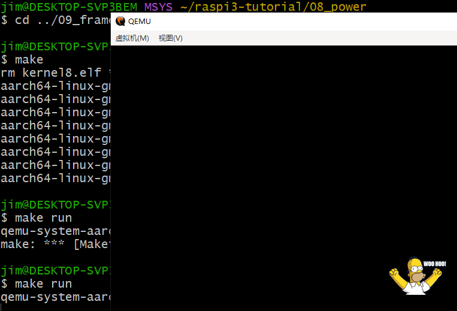
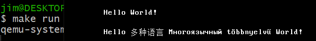

# 项目介绍：嵌入式QEMU教程

|作者|将狼才鲸|
|---|---|
|创建日期|2022-11-14|

* Gitee源码和工程地址：[才鲸嵌入式 / 嵌入式QEMU教程](https://gitee.com/langcai1943/cj-security-camera)
* CSDN文章地址：[项目介绍：嵌入式QEMU教程](https://blog.csdn.net/qq582880551/article/details/127857259)
* *注：文章中的子文档链接需在Gitee中的readme.md仓库介绍中才能点开，我设置的是相对地址，也可以在Gitee仓库的doc文件夹下手动点开。*

---

* 简介：硬件平台均为QEMU模拟器。
1. 当前裸机项目使用ARM Cortex-A7 32位内核、带有GPU（2D 3D显示加速、图片和音频视频编解码）的博通BCM2836芯片（树莓派2B同款硬件，但不使用树莓派的系统和软件）。
2. 当前Linux项目使用ARM Versatile Express开发板，从源码编译运行U-Boot、Linux和根文件系统。

<center>表1 本仓库软硬件资源描述</center>

|**软硬件资源**|详情|备注|
|---|---|---|
|QEMU BCM2836芯片模拟器|900MHz 4核 ARM Cortex-A7 CPU, VideoCore IV 双核 GPU (2D 3D显示加速, 视频编解码), 1GB 内存, 100M以太网, HDMI显示, USB2.0 x 4, SD卡, 音频输出, GPIO, 摄像头输入, 液晶屏接口, 串口, SPI, I2C等嵌入式通用模块|树莓派2B同款硬件|
|**硬件模块测试用例：raspi3-tutorial**|裸机程序，包含让CPU运行的空程序、串口打印、屏幕图像输出、屏幕文字输出、读写SD卡、bootloader|树莓派3B同款硬件BCM2837，在仓库根目录raspi3-tutorial文件夹中, 开箱即用, 直接make, 直接在QEMU中运行|
|**裸机项目**|汇编boot，串口打印，......进行中......|树莓派2B同款硬件BCM2836|
|**RTOS项目**|......未开始......||
|**Linux项目**|uboot编译运行，Linux和根文件系统编译运行|ARM CoreTile Express开发板|
|**使用的开源库**|||

---

## 一、前言

1. 作为一名嵌入式软件工程师，我想自己从头开始做一个实际的嵌入式产品；结合自己工作中接触过的技术，我希望最终的项目中有通信、GUI、音视频编码、音视频解码功能的设备。

2. 创建这个仓库的目的，一是记录自己学习到的技术，防止时间久了忘记；二是给其他也想要做一个实际嵌入式项目的人一个参考，最好是能开箱即用，能看到产品的效果，然后能方便的阅读源码和注释，知晓原理，而不用自己去一步步搭建环境；搭环境是很痛苦的，往往遇到一个问题跨不过去，又没人指导，然后就不得不放弃了。

3. 我不使用具体的开发板，而是使用QEMU模拟器；原因一就是上面“第2条前言”所描述的通用和开箱即用，因为不同的开发板太多了，开发板也很贵，真的没必要让看这个工程的人还去花钱买块板子，板子买回来很大的概率也是吃灰。原因二是我自己也从来没买过开发板，也不喜欢在开发板上频繁下载调试程序，很慢也很烦，一般纯逻辑的模块我会先用gcc或者模拟器验证好，然后再上板子调试。原因三是芯片原厂开发芯片开发包时，芯片还没设计好的初期也会先使用模拟器，不过他们完整的模拟器代码并没有流传出来而已。

4. 在硬件选型的过程中，其实我最中意的是瑞芯微的芯片，但无奈他们家的产品在QEMU模拟器中并不支持；然后我查看了QEMU支持的所有嵌入式芯片，发现除了Intel、AMD，其它的芯片都不支持其中的显示加速、音视频编解码（一开始我以为QEMU对博通VideoCore GPU会支持，后面发现只是模拟了核间通信，但此时我已经做完了这个项目的准备工作了），有些芯片仅仅只支持了不加速的液晶屏显示、触摸屏、音频解码，还有些芯片只支持了串口、GPIO、SPI、I2C等基础的外设。阴差阳错间，我选择了树莓派。

5. 树莓派不是最理想的选项，最新的几款树莓派芯片都是64位的ARM；嵌入式当前流行32位CPU，所以我选择树莓派32位CPU的老版本；而且树莓派所使用的博通芯片的手册还是不公开的，能找到的资料也少，这对嵌入式开发很不利，但还好基本的外设寄存器地址还是能找到的，网上也能找到一些底层开发的教程；我刚毕业时也用过博通BCM2042和BCM20730蓝牙芯片，对博通也不是两眼一抹黑；尽管困难重重，但也要慢慢解决问题。

6. 其它带有GPU的MCU芯片还有RK3399、RV1126、RK3588、RK3288、Exynos4412、DM6446等；全志的资料不公开，和博通一样，只面向大客户公开资料，所以也放弃使用全志芯片；海思的芯片也没找到模拟器，也就不用了。

7. 一些带2D显示加速和音视频编解码模块的嵌入式开发板信息：
  * [RV1126/RV1109芯片 人工智能安防开发板介绍](https://blog.csdn.net/weixin_52411576/article/details/114986087)
  * [CORTEX-A9三星iTOP-4412开发开发板入门嵌入式](https://blog.csdn.net/mucheni/article/details/125204333)
  * [RK3399开发板](https://blog.csdn.net/Chihiro_S/article/details/105368415)
  * [IMX6UL开发板 mjpg-streamer 移植实现远程监控](https://blog.csdn.net/Chihiro_S/article/details/119753233)
  * [迅为RK3588开发板Linux安卓12瑞芯微ARM核心板人工智能工业AI主板](https://blog.csdn.net/mucheni/article/details/126267513)
  * [安卓开发板 MTK 方案 ARM 主板定制](https://blog.csdn.net/yangyang__z/article/details/126404411)
  * [海思Hi3518EV200+4G+RS232视频监控摄像开发板防雷防静电推荐图](https://blog.csdn.net/shanghaileimao/article/details/116229998)
  * [DM6446数字视频开发板](https://blog.csdn.net/weixin_33694172/article/details/93359406)
  * [andoird TV 优化学习笔记](https://blog.csdn.net/qw85525006/article/details/103220708) 

## 二、QEMU模拟器介绍

* QEMU是一个硬件模拟器和仿真器，和VMware类似，能安装和运行Windows和Linux，但除此之外它还可以模拟众多的嵌入式芯片和开发板，从ARM Cortex-M3到Cortex-Axx内核都支持。
* 你把QEMU当成一个开发板就行，编好了程序后，可以下到QEMU里面去运行。
* 同样能模拟嵌入式硬件的还有Keil，Keil debug时选中Simulator即可。
  * Keil模拟器的使用，详见我其它的两个仓库：
  * [才鲸嵌入式 / 8051_c51_单片机从汇编到C_从Boot到应用实践教程](https://gitee.com/langcai1943/8051-from-boot-to-application)
  * [才鲸嵌入式 / ARM-Cortex-M3从汇编到C_从Boot到应用教程](https://gitee.com/langcai1943/ARM-Cortex-M3_from-assembly-to-c)
* QEMU的详细介绍详见本仓库**子文档**：
  * [《01_QEMU仿真器-模拟器介绍.md》](./doc/01_QEMU仿真器-模拟器介绍.md)
  * [《02_QEMU默认支持的所有开发板列表.md》](./doc/02_QEMU默认支持的所有开发板列表.md)

## 三、树莓派介绍

* 树莓派本质上是一个计算机，所以提供了完整的操作系统和应用软件，但是它的老款芯片是32位的ARM，也可以用于嵌入式领域。
* 树莓派的详细介绍详见本仓库**子文档**：[《03_树莓派QEMU模拟器介绍.md》](./doc/03_树莓派QEMU模拟器介绍.md)

## 四、必须的准备工作

* 本章前面的总述和前面3小节只是对要做的工作进行一个文字描述，本章第4小节有完整的安装过程，可以直接跳到”4）完整的环境安装步骤“进行阅读。

1. 首先，需要Linux或者Windows MinGW等环境，如果你是第一次使用Linux，则不应该摸索Windows下的MinGW环境，这应该是对Linux已经很熟悉之后才做的事，因为在里面装软件很麻烦；你应该直接使用Ubuntu或其它Linux发行板，推荐在Windows下使用VMware虚拟机安装Ubuntu；具体的过程略。

2. Ubuntu下安装QEMU，这也等同于准备好了一块硬件开发板，过程略。

3. Ubuntu下安装ARM交叉编译工具，过程略。

4. 编译程序，运行程序。

* 如果你以前用过树莓派，那么请忘掉它，我们按照嵌入式的模式来。

* 写树莓派的底层程序，并不能像8051或普通MCU芯片一样，使用汇编，从零地址开始的复位中断开始写，能够控制芯片上电后执行的第一条指令；因为树莓派上电后是芯片里面的GPU先开始运行，并且这部分代码是不公开的，GPU底层的寄存器介绍也是不公开的，只能加载官方提供的GPU的驱动；GPU上电后再引导ARM CPU运行。
* 但其实如果不是在芯片原厂，一般嵌入式开发人员也不需要知道芯片开发包里面的boot是如何实现的，编译器里面的C标准库是如何实现的，中断向量表和堆栈是如何分配的，各个驱动模板是如何实现的，操作系统是怎么移植的；能用就行。

### 1）安装Linux环境

* 可以在Windows下安装MSYS2，或者安装Cygwin，这都是Linux运行环境；如果安装了Git，里面也会自带精简版的MSYS2+MinGW64；如果你有已经安装过MSYS2环境的朋友，特别是他已经安装好了树莓派交叉编译工具和其它工具，你可以将他安装过的文件夹拷过来，在你的电脑上也同样可以点开即用，换句话说就是安装过一次以后的MSYS2是绿色软件，只是文件比较大，会有几十G。
* 也可以先安装VMware Player虚拟机，然后在虚拟机中安装Ubuntu系统，这是一个Linux发行版；直接使用Linux系统，安装软件的教程和各种资料会比MinGW更方便；如果你有已经在虚拟机中安装过Linux的朋友，特别是他在已经安装好了树莓派交叉编译工具、QEMU和其它工具，你可以将他安装过的系统文件夹拷贝过来。
* 还可以使用双系统，或者干脆准备一台装了Linux的电脑。

### 2）用QEMU模拟器运行树莓派

* QEMU可以在Windows下安装，也可以在Linux下安装。

* *参考网址：*
  * [QEMU仿真树莓派1和3B-保姆级教程](https://zhuanlan.zhihu.com/p/452590356)
  * [使用QEMU模拟树莓派](http://t.zoukankan.com/HacTF-p-7773671.html)
  * [使用QEMU模拟树莓派Raspberry Pi](https://cloud.tencent.com/developer/article/1685107)
  * [QEMU 模拟启动 openEuler 的树莓派镜像](https://blog.csdn.net/hhs_1996/article/details/123153534)

### 3）编译树莓派程序

* 树莓派交叉编译工具可以在Windows下安装，也可以在Linux下安装。
  * 如果是在Linux下开发，则进入树莓派Github的tools仓库，下载这个文件夹，解压后添加环境变量即可使用；如果你以前用Linux开发过arm，也可以自行去ARM官网或者Linaro官网下载，编译程序的效果是一样的。

* *参考网址：*
  * [树莓派基础之交叉编译](https://blog.csdn.net/weixin_55374007/article/details/126697371)
  * [Windows下建立第一个树莓派应用程序-交叉编译](https://blog.csdn.net/yhhdll0107/article/details/123571694)
  * [树莓派（六）树莓派交叉编译](https://blog.csdn.net/weixin_50546241/article/details/126339437)
  * [Windows下建立第一个树莓派应用程序-交叉编译](https://blog.csdn.net/yhhdll0107/article/details/123571694)
  * [在window上如何搭建树莓派4b的RT-Thread开发环境](https://www.yisu.com/zixun/528265.html)
  * [在Windows下使用C语言开始Raspberry Pi Pico开发](https://www.lexsion.com/index.php/archives/199/)
  * [树莓派开发 --- 交叉编译工具](https://blog.csdn.net/qq_42047245/article/details/124936210)

### 4）完整的环境安装步骤

* 写在前面，我会使用Windows下的MSYS2环境 + QEMU，和VMware Player16 + Ubuntu18.04 + QEMU。如果你没用过Linux，则建议使用VMware虚拟机 + Ubuntu的开发环境，因为MSYS2中安装软件的教程很难快速找到，需要有一些使用Linux的经验才知道怎么安装特定软件；我的MSYS2环境添加了32位和64位的交叉编译工具，他们的来源不一样，后面会详述。
* MSYS2中的QEMU只能运行裸机程序、U-Boot和Linux kernel（加载根文件系统会失败），而Ubuntu下的QEMU才能运行U-Boot + kernel + rootfs。如果你除了裸机编程，还想学习Linux编程，则建议你跳过本章节（第四章）剩下的内容，直接跳转到本文档的“九、Linux编程”章节安装Linux的环境，然后再继续第五章。
* 下面是Windows下从头到尾的工具软件安装步骤：
  * 推荐使用MSYS2 + 已经用MinGW32或MinGW64编译好的程序，在Linux下常用的功能，也都能在这个环境下实现，只是有些教程没有Ubuntu下那么好找；在MSYS2中不能使用Linux的程序，必须用MinGW将源码重新编译过后才能使用，这一般是软件供应商已经编译好了，可以直接下载的。
  * MSYS2的更多信息详见本仓库**子文档**：[《04_MSYS2简述.md》](./doc/04_MSYS2简述.md)

<center>表2 MSYS2、MinGW和Cygwin的关系</center>

|软件名|版本|作用|特点|
|---|---|---|---|
|MSYS|MSYS，MSYS2|Linux命令行终端：Shell，Bash|没有在Windows下编译Linux程序的工具集，会自带已经被MinGW编译好的一些包；脱胎于Cygwin，但容量更小；MSYS2是因为MSYS常年不更新而新组的的一个项目；MSYS2安装完后的文件名为msys64，你可以将你安装好之后的msys64文件夹打包发给别人，这样别人无安装就可以用了，只是容量有点大，几十G|
|MinGW|MinGW32，MinGW64|一组编译工具链|编译后生成的是纯粹的Windows程序；它自带的命令行终端很难用也不全，要和MSYS2终端配合使用；MinGW64是因为MinGW32常年不更新而新组的的一个项目|
|Cygwin|Cygwin|编译工具+命令行|有模拟层，将Linux API转成Windows API再执行程序，效率低，容量大，速度慢，2010年左右在Windows下搭建交叉编译环境时还多用它；要运行纯粹的Linux程序时也用它|

* *参考网址：*
  * [CygWin、MingW、MSYS之间的关系](https://www.jianshu.com/p/09198f6e0a3c)
  * [Cygwin、Msys、MinGW、Msys2的区别与联系(转)](https://blog.csdn.net/u012294613/article/details/126460773)
  * [Cygwin、MinGw、mingw-w64,MSys msys2区别与联系](https://www.cnblogs.com/zengkefu/p/7371943.html)
  * [MSYS2+MinGW32 编译 QEMU需做的准备工作](https://blog.csdn.net/mozart_cai/article/details/79680685)
  * [在Windows上编译QEMU](https://blog.csdn.net/weixin_34062329/article/details/91654482)

#### 4.1 安装MSYS2

1. 我当前下载的版本是msys2-x86_64-20221028.exe
  * 网上的安装教程是[使用msys2打造优雅的开发环境](https://www.cnblogs.com/52fhy/p/15158765.html)
  * 在官网主页找到下载链接：[github.com/msys2/msys2-installer/releases/download/2022-10-28/msys2-x86_64-20221028.exe](https://github.com/msys2/msys2-installer/releases/download/2022-10-28/msys2-x86_64-20221028.exe) ，85M左右，这只是一个安装器，不是全部的软件；这是GitHub的地址，有时候下载慢，有时候无法访问；这个可下载的软件是CICD自动生成的，国内的Gitee镜像中也没有这个下载包；但你也可以在网上其它的地方比如网盘之类的找到这个文件的下载。
2. 我将软件安装在D盘根目录，软件会安装在d:\msys64中，安装目录不能有空格、中文。
3. 安装完之后先不打开软件，先将国外镜像地址换成国内镜像地址，参考上方教程。
4. 电脑配置环境变量，在PATH中增加一行D:\msys64\usr\bin
  * [win10环境变量怎么设置 win10设置环境变量的方法](https://www.win7zhijia.cn/win10jc/win10_47252.html)
5. 双击运行主目录下的msys2.exe或者mingw64.exe都可以，其它的exe有些是32位的，有些是非gcc编译器对应的软件。

#### 4.2 MSYS2中安装QEMU

* 因为我已经有了MSYS2环境，可以在里面直接安装QEMU；你下载Windows版本的QEMU单独安装，也是走的MSYS2+MinGW这一套，只是和Git一样，它们都是在自己的软件安装包自带了精简版的MinGW环境。

* 我们不需要用MinGW64或者MinGW32编译QEMU，我们只安装已经编译好的QEMU软件；网上没搜到MSYS2中安装QEMU的教程，但是我们知道MSYS2中的所有软件都在[packages.msys2.org/repos](https://packages.msys2.org/repos) 、 [MSYS2 Base Packages](https://packages.msys2.org/base) 和 [MSYS2 Packages](https://packages.msys2.org/package)中有描述。
* 在https://packages.msys2.org/base 中能找到mingw-w64-qemu；在https://packages.msys2.org/package/ 中能找到mingw-w64-x86_64-qemu；在https://packages.msys2.org/package/mingw-w64-x86_64-qemu?repo=mingw64 中能找到/mingw64/bin/qemu-system-aarch64.exe、/mingw64/bin/qemu-system-arm.exe，也能找到安装方法：pacman -S mingw-w64-x86_64-qemu；我当前使用的是Build Date: 2022-10-10 20:19:53，Installed Size: 768.72 MB，实际安装完后有2G。
* 查看是否安装成功：进入cd /mingw64/bin/ 然后./qemu-system-arm.exe --version查看版本号；后续还需要设置环境变量，这里暂略。
* 能看到输出信息：

```shell
jim@DESKTOP-SVP3BEM MSYS /mingw64/bin
$ ./qemu-system-arm.exe --version
QEMU emulator version 7.1.0
Copyright (c) 2003-2022 Fabrice Bellard and the QEMU Project developers
```

#### 4.3 MSYS2中安装32位和64位ARM交叉编译工具

* 一些工具介绍：
  * （当前不用）树莓派提供了在Linux下使用的交叉工具包的文件夹名为gcc-linaro-arm-linux-gnueabihf-raspbian-x64，使用的编译器名为arm-linux-gnueabihf-gcc，下载地址[raspberrypi-tools/ arm-bcm2708](https://gitee.com/qianchenzhumeng/raspberrypi-tools/tree/master/arm-bcm2708)。
  * （不用）GNU官方提供了树莓派在Windows中使用的交叉工具包，默认的工具是使用Visual Studio +  VisualGDB来进行编译的。  
  32位地址：[Prebuilt Windows Toolchain for Raspberry Pi](https://gnutoolchains.com/raspberry/)  
  64位地址：[Prebuilt Windows Toolchain for Raspberry Pi (64-bit)](https://gnutoolchains.com/raspberry64/)  
  * （不用）ARM在Windows下自带的交叉编译工具为arm-gnu-toolchain-11.3.rel1-mingw-w64-i686-arm-none-eabi.zip，网页路径在https://developer.arm.com/downloads/-/arm-gnu-toolchain-downloads ，交叉编译工具名为arm-none-eabi-gcc，这是不能用于Linux编程的，我们不使用树莓派自带的交叉编译工具，而直接使用ARM的；因为树莓派没有直接给出MinGW下的交叉编译工具。

* 但也不在ARM官方下载，我们在MSYS2中同样也能找到：在https://packages.msys2.org/base 中能搜到mingw-w64-arm-none-eabi-gcc和mingw-w64-arm-none-eabi-gdb
  * MSYS2下载命令 pacman -S mingw-w64-x86_64-arm-none-eabi-gcc，大小有1.24 GB，参考网址：[Package: mingw-w64-x86_64-arm-none-eabi-gcc](https://packages.msys2.org/package/mingw-w64-x86_64-arm-none-eabi-gcc?repo=mingw64)
  * GDB调试工具下载的命令 pacman -S mingw-w64-x86_64-arm-none-eabi-gdb，大小有7.92 MB，参考网址：[Package: mingw-w64-x86_64-arm-none-eabi-gdb](https://packages.msys2.org/package/mingw-w64-x86_64-arm-none-eabi-gdb?repo=mingw64)
  * 安装完成后的文件在msys64/mingw64/bin/arm-none-eabi-gcc.exe
  * 如果你需要使用aarch64-elf-gcc编译64位的ARM程序，在新版的树莓派中运行，则MSYS2网站中没有，你要去Linaro软件中下载。
* 如果有需要，你也可以安装用于64位ARM的交叉编译工具。
  * 软件名称：[gcc-linaro-7.5.0-2019.12-i686-mingw32_aarch64-linux-gnu.tar.xz](https://releases.linaro.org/components/toolchain/binaries/latest-7/aarch64-linux-gnu/gcc-linaro-7.5.0-2019.12-i686-mingw32_aarch64-linux-gnu.tar.xz) ，大小364M
  * 下载路径：https://releases.linaro.org/components/toolchain/binaries/latest-7/aarch64-linux-gnu/
  * 下载完之后放到msys64/mingw32/bin/里面去，用Linux命令解压，然后设置环境变量，使用方法和32位gcc交叉编译工具一样
  * 我msys64中的路径是msys64/mingw32/bin/gcc-linaro-7.5.0-2019.12-i686-mingw32_aarch64-linux-gnu/bin/aarch64-linux-gnu-gcc.exe
  * 在Linaro这里也能下到32位的GCC交叉编译工具：[gcc-linaro-7.5.0-2019.12-i686-mingw32_arm-linux-gnueabihf.tar.xz](https://releases.linaro.org/components/toolchain/binaries/latest-7/arm-linux-gnueabihf/)
  * https://www.linaro.org/ Linaro公司主要是做ARM的一些开源工具，树莓派也是直接使用的Linaro编译器。

* MSYS2安装make
  * pacman -S make
  * [Package: make](https://packages.msys2.org/package/make?repo=msys&variant=x86_64)

* *参考网址：*
  * [Windows下编译树莓派pico C\C++（Building on MS Windows）](https://blog.csdn.net/m0_45961169/article/details/127282390)
  * [树莓派 交叉编译环境搭建（Win 7）](https://www.cnblogs.com/easy-busy/p/4402218.html)
  * [【交叉编译踩坑指北（二）】windows10下VScode构建树莓派pico开发环境（C/C++）](https://blog.csdn.net/SuperiorEE/article/details/127380128)
  * [树莓派2 raspyberry Pi2 交叉编译app](https://www.cnblogs.com/zhangjiankun/p/4855169.html)
  * [Windows10下 交叉编译aarch64(ARMv8)架构Qt5.12.11库](https://blog.csdn.net/y_q_m/article/details/120319055)

#### 4.4 用现成的程序从QEMU运行树莓派

* 从以下网址https://gitee.com/mirrors_bztsrc/raspi3-tutorial/tree/master/0A_pcscreenfont 下载编译好的树莓派程序，我已下载好，存放在msys64家目录下的1_raspi/01_run文件夹中
* 使用命令运行：/mingw64/bin/qemu-system-aarch64 -M raspi3b -kernel ~/1_raspi/01_run/kernel8.img -d in_asm
* 能看到出现了QEMU窗口，并显示了hello world。
效果如下：

#### 4.5 交叉编译工具编译程序，并在树莓派QEMU模拟中运行

1. 在[mirrors_bztsrc/raspi3-tutorial](https://gitee.com/mirrors_bztsrc/raspi3-tutorial)下载一个国外的英文仓库，是演示64位ARM树莓派裸机编程的，我借鉴这里面的工程。
  * 这个工程已下载到当前仓库根目录下，我也会将这个目录拷贝到msys64的家目录下，我会将里面的Makefile和自动运行改成和msys64适配，保证一个make命令就能编译程序，一个make run就能在QEMU中运行刚刚编译的程序。
  * 输出qemu所在位置和aarch64编译器所在位置的环境变量，这样就不用每次都写完整的路径了。
  * 打开家目录也就是msys64/home/jim/下的.bashrc，在里面末尾加上  

``` shell
    export PATH=$PATH:/mingw64/bin  
    export PATH=$PATH:/mingw32/bin/gcc-linaro-7.5.0-2019.12-i686-mingw32_aarch64-linux-gnu/bin  
```

  * 生效配置 source ~/.bashrc
  * 查看环境变量，确认已经生效

```shell
    echo $PATH
```

2. 进入msys64 raspi3-tutorial源码目录，编译并运行
  * 源码我已经拷贝到msys64中，并且已经改了Makefile，能直接编译和运行，同时修改过以后的源码我也会在本仓重新上传
  * 源码路径 ~/raspi3-tutorial/01_bareminimum，也就是/home/jim/raspi3-tutorial/01_bareminimum，也就是D:\msys64\home\jim\raspi3-tutorial\01_bareminimum，后面所有的示例路径我都采用第一种写法。
  * 进入目录 cd ~/raspi3-tutorial/01_bareminimum
  * 编译 make
  * 运行 make run
  * make run能运行，是因为在Makefile里面写了命令 qemu-system-aarch64 -M raspi3b -kernel kernel8.img -d in_asm
  * 01_bareminimum用例是一个空程序，所以QEMU里面什么都不会显示，其它用例的效果我会再后面展示。

* *参考网址：*
* 树莓派有关裸机编程的教程很少，我只找到了几个英文教程和几篇中文博客：
  * 裸机编程：[mirrors_bztsrc / raspi3-tutorial](https://gitee.com/mirrors_bztsrc/raspi3-tutorial)
  * 编写操作系统：[lxjj / rpi4-osdev](https://gitee.com/lxjj/rpi4-osdev)
  * 一点中文翻译，[在树莓派4B上编写裸机操作系统(PART0)](https://www.bilibili.com/read/cv11175486)
  * 另一个树莓派操作系统开发：[Baking Pi – Operating Systems Development](https://www.cl.cam.ac.uk/projects/raspberrypi/tutorials/os/)
  * [RPi bring up hello world! 树莓派底层编程裸机点亮led](https://zhuanlan.zhihu.com/p/519166136)
  * [996refuse/emperorOS Public](https://github.com/996refuse/emperorOS/tree/756bb64a9019cd5c3ca2fa887c3a1d76b910c86f)
  * [4 anbox 树莓派 树莓派4裸机基础教程:从hello world开始](https://blog.csdn.net/weixin_36372094/article/details/112191177)
  * [Raspberry PI 系列 —— 裸机点亮LED灯](http://t.zoukankan.com/zhchoutai-p-6970667.html)

* *参考网址：*
* [树莓派的交叉编译 （BCM2835/6/7/BCM23711）](https://www.valvers.com/open-software/raspberry-pi/bare-metal-programming-in-c-part-1/)

#### 4.6 有关树莓派裸机编程的介绍

* 树莓派里面有GPU和ARM CPU，GPU先上电运行，然后再引导ARM运行
* 树莓派的GPU底层固件（Bootloader）是闭源的，但可以在此基础上引导自己的U-Boot、Linux kernel，也可以不用U-Boot和Linux，直接引导裸机程序或者RTOS；这种引导方式和Xilinx ZYNQ类似，ARM和FPGA一个先启动一个后启动。

* 一些其它的树莓派嵌入式相关的开源仓库：  
(1) 运行在 Raspberry Pi 上的小型嵌入式系统  
- Xinu project ([xinu-os/xinu](https://link.zhihu.com/?target=https%3A//github.com/xinu-os/xinu)) 一个操作系统
- Ultibo project ([ultibohub/Core](https://link.zhihu.com/?target=https%3A//github.com/ultibohub/Core)) 用Free Pascal编写的Raspberry Pi的全功能嵌入式（无操作系统）开发环境

(2) 一些在 Raspberry Pi 上可以嵌入在其他系统中的运行库  
- USPi([rsta2/uspi](https://link.zhihu.com/?target=https%3A//github.com/rsta2/uspi)), 一个小型的支持 USB 通讯的库

(3) 以及其他一些基于 Raspberry Pi 裸机开发例子：  
- Bare Metal Programming on Raspberry Pi 3：([bztsrc/raspi3-tutorial](https://link.zhihu.com/?target=https%3A//github.com/bztsrc/raspi3-tutorial))
- Raspberry Pi ARM based bare metal examples ([dwelch67/raspberrypi](https://link.zhihu.com/?target=https%3A//github.com/dwelch67/raspberrypi))

* *参考网址：*
  * [RPi bring up hello world! 树莓派底层编程裸机点亮led](https://www.bilibili.com/read/cv17759097/)
  * [从底层玩转树莓派](https://zhuanlan.zhihu.com/p/148629587)，里面有树莓派RTOS操作系统的链接
  * [详细到吐血 —— 树莓派驱动开发入门：从读懂框架到自己写驱动](https://huaweicloud.csdn.net/63561a2ad3efff3090b5a464.html)
  * [在树莓派3b上如何运行uboot](https://www.yisu.com/zixun/528297.html)
  * [7个别出心裁的树莓派优质项目集锦（完整代码+电路设计资料）](https://www.cirmall.com/articles/27528/)
  * [树莓派BootLoader](https://blog.csdn.net/rk2900/article/details/8936580)
  * [树莓派的启动流程](https://blog.csdn.net/qq_45172832/article/details/126040945)
  * [树莓派裸板linux,树莓派裸机开发步骤](https://blog.csdn.net/weixin_35578211/article/details/116987578)
  * [树莓派裸核程序开发 —— 从汇编到第一个C语言程序](https://blog.csdn.net/u014082689/article/details/89074600)
  * [树莓派裸机代码bootloader学习总结](https://blog.csdn.net/weixin_34001430/article/details/92686304)

---

## 五、raspi3-tutorial硬件测试用例

* 原始网址：[mirrors_bztsrc / raspi3-tutorial](https://gitee.com/mirrors_bztsrc/raspi3-tutorial)
* 本仓库中的地址：根目录/raspi3-tutorial/
* msys64中的地址：家目录 ~/raspi3-tutorial/
* 硬件是raspi3，64位ARM芯片，但因为有现成的代码，可以先熟悉编译环境，之后再在32位ARM上跑。

<center>表3 raspi3-tutorial各测试用例的描述</center>

|用例名称|作用|备注|
|---|---|---|
|00_crosscompiler|文档，只是描述编译器相关的内容||
|01_bareminimum|空程序，在汇编中死循环，只是为了验证编译器和模拟器安装正确，能够编译和运行||
|02_multicorec|写汇编boot，并引导C语言main函数运行||
|03_uart1|串口打印Hello world，从MSYS2控制台输出||
|04_mailboxes|CPU和GPU邮箱通信，通信成功后打印串口号||
|05_uart0|串口收发回环||
|06_random|打印随机数||
|07_delays|延时后打印||
|08_power|关机与重启||
|09_framebuffer|从屏幕显示未压缩的图片||
|0A_pcscreenfont|从屏幕显示点阵字库文字||
|0B_readsector|读SD卡扇区||
|0C_directory|读SD卡文件夹||
|0D_readfile|读SD卡文件||
|0E_initrd|根文件系统||
|0F_executionlevel|获取当前程序级别||
|10_virtualmemory|MMU虚拟内存映射||
|11_exceptions|测试异常中断||
|12_printf|测试printf输出||
|13_debugger|gdb调试输出||
|14_raspbootin64|一个简单的bootloader||
|15_writesector|写SD卡||

### 1）03_uart1

* 作用：串口打印Hello world，从MSYS2控制台输出
* 效果：

```shell
jim@DESKTOP-SVP3BEM MSYS ~/raspi3-tutorial/03_uart1
$ make
rm kernel8.elf *.o >/dev/null 2>/dev/null || true
aarch64-linux-gnu-gcc -Wall -O2 -ffreestanding -nostdinc -nostdlib -nostartfiles -c start.S -o start.o
aarch64-linux-gnu-gcc -Wall -O2 -ffreestanding -nostdinc -nostdlib -nostartfiles -c main.c -o main.o
aarch64-linux-gnu-gcc -Wall -O2 -ffreestanding -nostdinc -nostdlib -nostartfiles -c uart.c -o uart.o
aarch64-linux-gnu-ld -nostdlib -nostartfiles start.o main.o uart.o -T link.ld -o kernel8.elf
aarch64-linux-gnu-objcopy -O binary kernel8.elf kernel8.img

jim@DESKTOP-SVP3BEM MSYS ~/raspi3-tutorial/03_uart1
$ make run
qemu-system-aarch64 -M raspi3b -kernel kernel8.img -serial null -serial stdio
Hello World!
```

### 2）04_mailboxes

* 作用：CPU和GPU邮箱通信，通信成功后打印串口号
* 效果：

```shell
jim@DESKTOP-SVP3BEM MSYS ~/raspi3-tutorial/04_mailboxes
$ make
rm kernel8.elf *.o >/dev/null 2>/dev/null || true
aarch64-linux-gnu-gcc -Wall -O2 -ffreestanding -nostdinc -nostdlib -nostartfiles -c start.S -o start.o
aarch64-linux-gnu-gcc -Wall -O2 -ffreestanding -nostdinc -nostdlib -nostartfiles -c main.c -o main.o
aarch64-linux-gnu-gcc -Wall -O2 -ffreestanding -nostdinc -nostdlib -nostartfiles -c mbox.c -o mbox.o
aarch64-linux-gnu-gcc -Wall -O2 -ffreestanding -nostdinc -nostdlib -nostartfiles -c uart.c -o uart.o
aarch64-linux-gnu-ld -nostdlib -nostartfiles start.o main.o mbox.o uart.o -T link.ld -o kernel8.elf
aarch64-linux-gnu-objcopy -O binary kernel8.elf kernel8.img

jim@DESKTOP-SVP3BEM MSYS ~/raspi3-tutorial/04_mailboxes
$ make run
qemu-system-aarch64 -M raspi3b -kernel kernel8.img -serial null -serial stdio
My serial number is: 0000000000000000
```

### 3）05_uart0

* 作用：串口收发回环（串口重定向到MSYS2命令行终端）
* 效果：

```shell
jim@DESKTOP-SVP3BEM MSYS ~/raspi3-tutorial/05_uart0
$ make
rm kernel8.elf *.o >/dev/null 2>/dev/null || true
aarch64-linux-gnu-gcc -Wall -O2 -ffreestanding -nostdinc -nostdlib -nostartfiles -c start.S -o start.o
aarch64-linux-gnu-gcc -Wall -O2 -ffreestanding -nostdinc -nostdlib -nostartfiles -c main.c -o main.o
aarch64-linux-gnu-gcc -Wall -O2 -ffreestanding -nostdinc -nostdlib -nostartfiles -c mbox.c -o mbox.o
aarch64-linux-gnu-gcc -Wall -O2 -ffreestanding -nostdinc -nostdlib -nostartfiles -c uart.c -o uart.o
aarch64-linux-gnu-ld -nostdlib -nostartfiles start.o main.o mbox.o uart.o -T link.ld -o kernel8.elf
aarch64-linux-gnu-objcopy -O binary kernel8.elf kernel8.img

jim@DESKTOP-SVP3BEM MSYS ~/raspi3-tutorial/05_uart0
$ make run
qemu-system-aarch64 -M raspi3b -kernel kernel8.img -serial stdio
My serial number is: 0000000000000000
aaaaddddd
asdfasfsafsa
```

### 4）07_delays

* 延时后打印

```shell
jim@DESKTOP-SVP3BEM MSYS ~/raspi3-tutorial/07_delays
$ make run
qemu-system-aarch64 -M raspi3b -kernel kernel8.img -serial stdio
Waiting 1000000 CPU cycles (ARM CPU): OK
Waiting 1000000 microsec (ARM CPU): OK
Waiting 1000000 microsec (BCM System Timer): OK
```

### 5）08_power

* 关机与重启

```shell
jim@DESKTOP-SVP3BEM MSYS ~/raspi3-tutorial/08_power
$ make run
qemu-system-aarch64 -M raspi3b -kernel kernel8.img -serial stdio
 1 - power off
 2 - reset
Choose one: 2

 1 - power off
 2 - reset
Choose one: 1

 1 - power off
 2 - reset
Choose one:
jim@DESKTOP-SVP3BEM MSYS ~/raspi3-tutorial/08_power
```

### 6）09_framebuffer

* 从屏幕显示未压缩的图片



### 7）0A_pcscreenfont

* 从屏幕显示点阵字库文字



### 8）0F_executionlevel

* 获取当前程序级别

```shell
jim@DESKTOP-SVP3BEM MSYS ~/raspi3-tutorial/0F_executionlevel
$ jim@DESKTOP-SVP3BEM MSYS ~/raspi3-tutorial/0F_executionlevel
$ make run
qemu-system-aarch64 -M raspi3b -kernel kernel8.img -serial stdio
Current EL is: 00000001
```

### 9）11_exceptions

* 测试异常中断

```shell
jim@DESKTOP-SVP3BEM MSYS ~/raspi3-tutorial/11_exceptions
$ make run
qemu-system-aarch64 -M raspi3b -kernel kernel8.img -serial stdio
Synchronous: Data abort, same EL, Translation fault at level 2:
  ESR_EL1 0000000096000006 ELR_EL1 0000000000080CC4
 SPSR_EL1 00000000200003C4 FAR_EL1 FFFFFFFFFF000000

jim@DESKTOP-SVP3BEM MSYS ~/raspi3-tutorial/11_exceptions
```

### 10）12_printf

* 测试printf输出

```shell
jim@DESKTOP-SVP3BEM MSYS ~/raspi3-tutorial/12_printf
$ make run
qemu-system-aarch64 -M raspi3b -kernel kernel8.img -serial stdio
Hello World!
This is character 'A', a hex number: 7FFF and in decimal: 32767
Padding test: '00007FFF', '    -123'

jim@DESKTOP-SVP3BEM MSYS ~/raspi3-tutorial/12_printf
```

### 11）13_debugger

* gdb调试输出

```shell
jim@DESKTOP-SVP3BEM MSYS ~/raspi3-tutorial/13_debugger
$ make run
qemu-system-aarch64 -M raspi3b -kernel kernel8.img -serial stdio
Synchronous: Breakpoint instruction
> run
 x0: 000000000008EF7C   x1: 0000000000000301   x2: 0000000000000070
 x3: 000000000000000B   x4: 0000000000024000   x5: 0000000000000000
 x6: 0000000000000000   x7: 0000000000000000   x8: 0000000000000000
 x9: 0000000000000000  x10: 0000000000000000  x11: 0000000000000000
x12: 0000000000000000  x13: 0000000000000000  x14: 0000000000000000
x15: 0000000000000000  x16: 0000000000000000  x17: 0000000000000000
x18: 0000000000000000  x19: 0000000000000000  x20: 0000000000000000
x21: 0000000000000000  x22: 0000000000000000  x23: 0000000000000000
x24: 0000000000000000  x25: 0000000000000000  x26: 0000000000000000
x27: 0000000000000000  x28: 0000000000000000  x29: 000000000007FFF0
x30: 000000000008EF7C  elr_el1: 8EF7C  spsr_el1: 600003C4
  esr_el1: F2000000  far_el1: 0
sctlr_el1: 30D00800  tcr_el1: 0
>
```

## 六、BCM2836芯片描述

### 1）BCM2836芯片资料

* 树莓派按时间的板子信息如下，因为嵌入式一般是用32位的CPU，所以我使用低版本树莓派，我会将要使用的型号加粗标注：

<center>表4 树莓派的所有板子</center>

|发布时间|名称|芯片|外设|
|---|---|---|---|
|2011-12|Raspberry Pi Model B|BCM2835 ARM1176JZF-S 700MHz 512M|有网口、无WiFi和蓝牙|
|2014-7-14|Raspberry Pi Model B+|同上，BCM2835 ARM1176JZF-S 700MHz 512M|同上|
|2014-11-11|Raspberry Pi Model A+|同上，BCM2835 ARM1176JZF-S 700MHz 512M|无网口、WiFi和蓝牙|
|2015-02-02|**Raspberry Pi 2 Model B**|**BCM2836** ARM **Cortex-A7** 900MHz 4核 1G|**有网口**、无WiFi和蓝牙|
|2015-11-26|Raspberry Pi Zero|BCM2835 ARM11 1GHz DDR512M|无网口、WiFi和蓝牙|
|2016-02-29|Raspberry Pi 3 Model B|BCM2837 ARM Cortex-A53 1.2GHz 64位4核 1GB|有网络、WiFi和蓝牙|
|2017-3-1|**Raspberry Pi Zero W**|**BCM2835 ARM11** 1GHz 512M|无网口，**有WiFi和蓝牙**|
|2018-3-4|Raspberry Pi 3 Model B+|BCM2837 ARM Cortex-A53 1.2GHz 64位4核 1GB|有网络、WiFi和蓝牙|
|2018-11-15|Raspberry Pi 3 Model A+|BCM2837B0 ARM Cortex-A53 1.4GHz 64位4核 1GB|无网络、有WiFi和蓝牙|
|2019-06-24|Raspberry Pi 4 Model B|BCM2711 ARM Cortex-A72 1.5GHz 64位4核 8GB|有网络、WiFi、蓝牙|

* *参考资料：*
  * [树莓派介绍以及FAQ](https://shumeipai.nxez.com/intro-faq)

* 我使用32位ARM Cortex-A7 4核的BCM2836芯片，该芯片的参数如下；2836的文档是以2835为基础的，所以也要看2835的文档：
  * BCM2836官网资料[BCM2836](https://www.raspberrypi.com/documentation/computers/processors.html#bcm2836)
  * BCM2835官网资料[BCM2835](https://www.raspberrypi.com/documentation/computers/processors.html#bcm2835)
  * BCM2835外设文档：[BCM2835 ARM Peripherals](https://datasheets.raspberrypi.com/bcm2835/bcm2835-peripherals.pdf)
  * BCM2835勘误表：[BCM2835 datasheet errata](https://elinux.org/BCM2835_datasheet_errata)
  * GPU手册：[VideoCore® IV 3D  Architecture Reference Guide](https://docs.broadcom.com/doc/12358545)
  * [博通GPU驱动](https://docs.broadcom.com/docs/12358546)
  * BCM2836外设：[bcm2836-peripherals.pdf](https://datasheets.raspberrypi.com/bcm2836/bcm2836-peripherals.pdf)
  * BCM2836 ARM Cortex-A7 MPCore技术参考手册：[Cortex-A7 MPCore Technical Reference Manual](https://documentation-service.arm.com/static/602cf701083323480d479d18?token=)
  * BCM2835 ARM11内核：[ARM1176JZF-S Technical Reference Manual r0p7](https://documentation-service.arm.com/static/5e8e294efd977155116a6ca3?token=)
  * ARM汇编文档：[ARM®  Compiler toolchain v5.02 for µVision]()https://developer.arm.com/documentation/dui0588/latest/

* 芯片的Boot
  * 芯片的Boot在E2PROM中，是给GPU用的，GPU先启动，然后在引导ARM；Boot固件可以用工具更新，但它是闭源的
  * 详见[Updating the EEPROM Configuration](https://www.raspberrypi.com/documentation/computers/raspberry-pi.html#raspberry-pi-4-boot-eeprom)

* *参考资料：*
  * [Raspberry Pi官网](https://www.raspberrypi.com/)

### 2）BCM2836芯片资源

* BCM2836是基于BCM2835的，只是在BCM2835的基础上将CPU从ARM11换成了ARM Cortex-A7，以为外设资源还需要看BCM2835的芯片手册。

<center>表5 博通BCM2836芯片的所有模块</center>

|模块名称|描述|备注|
|---|---|---|
|GPU|VideoCore IV，支持OpenGL ES 2.0，1080p 30帧 H.264和MPEG-4解码||
|HDMI|HDMI音频视频输出||
|USB|4个USB 2.0，Core和Phy用的是Synopsys IP，该模块被GPU所拥有||
|SD EMMC|支持MultiMedia和SD卡||
|以太网|100M||
|定时器|1个64位定时器，2个32位定时器||
|Mailbox|GPU和CPU核间通信|
|中断控制|GPU中断和ARM中断||
|UART|两个串口||
|SPI|SPI1、SPI2||
|BSC（I2C）|Broadcom Serial Controller (BSC)，BSC0~2三个，I2C||
|DMA|数据快速搬运，16个通道||
|GPIO|54个IO口||
|I2S PCM|音频输入输出||
|PWM|Pulse Width Modulator||
|SPI|SPI总线||

* ARM Cortex-A7支持ARM、Thumb和Thumb-2指令集。
  * [Arm技术文档分享|Cortex-A 系列处理器Cortex-A7文档（附PDF）](https://aijishu.com/a/1060000000103112)

## 七、BCM2836裸机编程

### 1）可以参考的教程

* Boot流程介绍：
  * 一般ARM芯片从0地址启动，而0地址默认是复位中断的入口，写了复位中断处理程序后，进一步向下执行就是配置堆和栈的地址与大小，配置系统频率、DDR内存，跳转到C语言Main()函数执行。
  * 而BCM2836是GPU先运行，并且GPU的Boot程序是闭源的，所以是GPU从0地址开始跑；
  * GPU先运行bootcode.bin这个程序，再引导start.elf程序运行，然后再引导kernel8.img这个ARM程序运行，ARM程序运行的起始地址是固定的0x8000，所以写ARM裸机程序的时候第一个代码段要指定到这个地址。
  * 写ARM裸机程序时，一些必要的芯片初始化也可以省略，因为GPU已经帮忙做了，外设寄存器地址从0x3F000000虚拟地址开始
  * 有关BCM2836 Boot的介绍详见本地文档[./raspi3-tutorial/README.md](./raspi3-tutorial/README.md) 的“About the hardware”小节。
  * BCM2836 ARM启动前的Boot程序下载地址：[Welcome to the Raspberry Pi Firmware Wiki](https://github.com/raspberrypi/firmware/wiki)
  * Boot固件下载地址2：[raspberrypi/firmware](https://github.com/raspberrypi/firmware/tree/master/boot)
  * 这里有树莓派官方的ARM Boot汇编代码：[tools/armstubs/armstub8.S](https://github.com/raspberrypi/tools/blob/master/armstubs/armstub8.S)

* 几个对裸机编程有帮助的教程：
  * [Baking Pi – Operating Systems Development](https://www.cl.cam.ac.uk/projects/raspberrypi/tutorials/os/)
  * 上面的教程：目的是讲述怎么用汇编编程，只支持Raspberry Pi Model B，BCM2835 ARM1176JZF-S，完全用汇编编写；控制LED灯和GPIO，控制GPU在屏幕上显示内容，绘制图形，用汇编实现printf，键盘输入。
  * [dwelch67/raspberrypi](https://github.com/dwelch67/raspberrypi)
  * 上面的教程：支持树莓派1和2，写ARM裸机程序，里面是一个个分开的用例，有串口、SPI、显示、解压缩、显示图片、ARM Bootloader等，值得一看。
  * [PeterLemon/RaspberryPi](https://gitee.com/mirrors_PeterLemon/RaspberryPi) ，https://github.com/PeterLemon/RaspberryPi
  * 上面的教程：主要是汇编，写了文件解码、音频播放、屏幕显示、绘图、播放视频等。
  * [rsta2/circle](https://github.com/rsta2/circle)
  * 上面的教程：主要是用C++写的树莓派裸机程序，很全，各个硬件模块的驱动都有
  * [DexOS the game console OS](http://dex-os.github.io/) 一个用汇编写的操作系统
  * [DexBasic For the Raspberry pi](http://dex-os.github.io/DexBasic/DexBasic.htm) 一个树莓派汇编编译器
  * [A Raspberry Pi 3 (formerly Raspberry Pi 2 v1.1) based games console, including RTOS, GPU driver, SDK](https://jaystation2.maisonikkoku.com/) 树莓派GPU程序

* *参考网址：*
* https://github.com/raspberrypi 里有树莓派的一些仓库集合，有用的一些仓库有：
  * https://github.com/raspberrypi/tools
  * Source code for ARM side libraries for interfacing to Raspberry Pi GPU：https://github.com/raspberrypi/userland
  * https://github.com/raspberrypi/libcamera
  * https://github.com/raspberrypi/firmware
  * The official documentation for Raspberry Pi computers and microcontrollers：https://github.com/raspberrypi/documentation
  * https://github.com/raspberrypi/linux
  * Github链接如果打不开，则可以将链接放到Gitee里搜索，一般都有人上传镜像

### 2）本地裸机项目介绍

* 裸机项目的详细介绍参见本仓库子文档：[嵌入式开源项目-CJ安防摄像机 裸机项目介绍](./src/readme.md)

<center>表6 源文件结构与描述</center>

|文件夹|文件名|作用|描述|
|---|---|---|---|
|arch||硬件相关源码的文件夹||
|samples||单元测试用例所在的文件夹|验证某项功能是否已实现|
|samples/01_asm_boot||BCM2836的汇编boot和串口输出||
|||……||

#### 1、硬件平台

* 裸机项目使用QEMU模拟器
* 树莓派模拟器介绍详见QEMU源码中的qemu\docs\system\arm\raspi.rst
  * 支持的板子有：raspi0、raspi1a+、raspi2b、raspi3a+、raspi3b
  * 支持的模块有：ARM核、GPU固件特性、ARM和GPU核间通信邮箱、中断控制、时钟与复位控制、定时器、GPIO、串口、随机数发生器、显示帧缓存、USB、SD卡、芯片温度传感器。
  * 不支持的模块有：SPI、ADC、PWM、GPU
  * 运行板子基础的命令有：qemu-system-aarch64 -M raspi3b
  * QEMU和树莓派有关的源码细节：
    * qemu\hw\arm\raspi.c
    * qemu\include\hw\intc\bcm2835_ic.h, bcm2836_control.h
    * qemu\include\hw\arm\bcm2836.h, bcm2835_peripherals.h

```C
#include "hw/char/pl011.h"
#include "hw/char/bcm2835_aux.h"
#include "hw/display/bcm2835_fb.h"
#include "hw/dma/bcm2835_dma.h"
#include "hw/intc/bcm2835_ic.h"
#include "hw/misc/bcm2835_property.h"
#include "hw/misc/bcm2835_rng.h"
#include "hw/misc/bcm2835_mbox.h"
#include "hw/misc/bcm2835_mphi.h"
#include "hw/misc/bcm2835_thermal.h"
#include "hw/misc/bcm2835_cprman.h"
#include "hw/misc/bcm2835_powermgt.h"
#include "hw/sd/bcm2835_sdhost.h"
#include "hw/gpio/bcm2835_gpio.h"
#include "hw/timer/bcm2835_systmr.h"
```

* *参考资料：*
  * [QEMU 不模拟视频核心硬件;尝试通过 VCHIQ 与之交互的程序将失败](https://raspberrypi.stackexchange.com/questions/23127/failed-to-open-vchiq-instance-rpi-on-qemu-linux-kernel-mac)

#### 2、arch文件夹

1. 裸机源码目录和文件类型仿照Linux的风格来布置，参考的具体Linux版本为2022-11-07 07:07打tag的linux_6.1-rc4版本。
  * linux_6.1-rc4版本代码查看和下载路径：[Linux 6.1-rc4](https://gitee.com/mirrors/linux_old1/tree/v6.1-rc4)
* arch文件夹里面存放和硬件相关的内容，能抽象出去的纯逻辑内容都会剥离出去。
* 因为一个功能或者模块可能会被拆分为硬件相关和硬件无关的部分，所以其它文件夹里的.c/h文件，可能在arch文件夹内会有同名的文件存在。
* 不像普通的单片机源码结构同名的.c源文件和.h头文件放在同一个文件夹内，这个裸机工程里源文件和头文件是放在不同的文件夹内的；头文件单独放在一起方便单独输出调用接口；这样在有需要时也方便对底层代码保密，用多了也就能对这种代码组织结构习惯了。
* arch文件夹里面有汇编写的Boot代码，汇编先执行后再引导C语言的main()函数。
  * Cortex-A7汇编语言、关键字、伪指令和编码风格详见本仓库内的子文档：[《05_ARM Cortex-A7汇编语言和GNU伪指令介绍.md》](./doc/05_ARM Cortex-A7汇编语言和GNU伪指令介绍.md)
* BCM2836外设地址可以参见Linux中设备树的源码：https://gitee.com/mirrors/linux_old1/blob/master/arch/arm/boot/dts/bcm2836-rpi-2-b.dts ，和https://gitee.com/mirrors/linux_old1/blob/master/arch/arm/boot/dts/bcm283x.dtsi
* BCM2836的汇编boot可以参见Linux中arch/arm/boot/中的代码： https://gitee.com/mirrors/linux_old1/blob/master/arch/arm/boot/bootp/init.S
* BCM2836的汇编boot也可以参见U-Boot中arch/arm/cpu/armv7/中的代码：https://gitee.com/mirrors/u-boot/blob/master/arch/arm/cpu/armv7/start.S

2. BCM2836的寄存器地址头文件，通过在Ubuntu下下载Linux kernel源码，安装树莓派提供的ARM交叉编译工具，将BCM2835的默认配置改成BCM2836的，然后编译生成。

#### 3、samples文件夹

* 大量测试用例的工程都在samples文件夹中
* 已实现的有汇编boot，串口输出，

#### 4、

## 八、RTOS编程

## 九、Linux编程

* 前提：编译U-Boot和Linux kernel源码时，源码版本、PC主机Linux系统版本、交叉编译器版本都有影响，最好按照网上教程中相同的版本来尝试，要不然经常会遇到编译时遇到了问题，但又搜不到解决方法的尴尬局面。

* 必须在Linux系统中编译（如Ubuntu），不能在MSYS2中编译。

### 1）直接编译Linux源码并运行

#### 1、编译U-Boot并在QEMU中运行

* 网上能搜到的QEMU + U-Boot已有的示例都是使用的ARM官方的开发板配置：如vexpress_ca9x4_defconfig、qemu_arm_vexpress_defconfig、versatile_defconfig，第一阶段我也使用相同的配置，后续我会在树莓派2b的硬件上尝试。
* 编译好的u-boot文件放在本仓库根目录/linux/文件夹下，可以直接运行查看效果

* 当前硬件为ARM Versatile™ Express开发板系列的CoreTile Express主板。
  * 开发板资料：[express_ca9x4 uboot分析](https://www.cnblogs.com/wjx321/p/7226410.html)

* 我使用最新版本的U-Boot官方源码，系统使用的是VMware Player Ubuntu18.04。当前下载的U-Boot版本是v2023.01-rc2，地址：[Gitee 极速下载 / u-boot Prepare v2023.01-rc2](https://gitee.com/mirrors/u-boot/repository/archive/v2023.01-rc2)，文件有33M，要查看所有版本的话则进入https://gitee.com/mirrors/u-boot/tags
  * 当前VM Player最新的版本是17，https://customerconnect.vmware.com/en/downloads/info/slug/desktop_end_user_computing/vmware_workstation_player/17_0 ，但我因为之前已经安装了16，所以就用这个。没用过VM的建议先用VMware Workstation的破解版，网上的教程更多，但是Player和VM的使用方法是一样的，如果遇到了问题可以直接按VM搜到的解决办法来处理。
  * 我在32位Ubuntu16.04上编译最新的U-Boot有报错，中文和外文网站搜索都未解决问题，见于16.04的版本官方也早已不支持了，现在重装为64位的Ubuntu18.04
  * Ubuntu下载请找国内源下载，16.04是最后一个提供32位系统的版本，不用配置32位的依赖库。

* *参考网址*
  * [qemu启动uboot](https://blog.csdn.net/jqh_111/article/details/83720406)
  * [QEMU 实验(二): 通过 u-boot 启动 kernel](https://www.jianshu.com/p/f7d5b6ad0710)
  * [QEMU模拟arm u-boot/linux【转】 ](https://www.cnblogs.com/sky-heaven/p/16305974.html)
  * [Linux内核实战应用：编译uboot并灵活使用qemu](https://zhuanlan.zhihu.com/p/547338158)

---

* 如果使用虚拟机，则下载安装VMware Player，过程略。
* 下载并安装64位Ubuntu 18.04，因为我的笔记本电脑是2012年买的，配置不行，所以我在虚拟机中用老系统能跑的比较快；Ubuntu 18.04系统会持续支持到2028年，不用担心里面的软件过时。
  1. 不要从Ubuntu官方下载，从各种大学的镜像中下载，速度会更快，我下载的地址是 [ubuntu-18.04.6-desktop-amd64.iso](http://mirrors.ustc.edu.cn/ubuntu-releases/18.04/ubuntu-18.04.6-desktop-amd64.iso)，如果要下载其它的版本，如Ubuntu 22.04，则进入http://mirrors.ustc.edu.cn/ubuntu-releases/ 对应的文件夹中，下载.iso文件；不管是Intel芯片还是AMD芯片，iso的文件尾都是amd64.iso，都可以用。
  2. 虚拟机中安装Ubuntu18.04的过程略；为了在命令行中进入桌面方便，我选择先安装英文系统，然后再安装中文输入法；安装要花几十分钟，安装的过程中要不联网，否则安装的过程中会更新程序，速度非常慢。
  * [VMware安装ubuntu18.04](https://blog.csdn.net/weixin_43928755/article/details/125780576)
  3. 如果你用的笔记本，Ubuntu18虚拟机中使用不了触摸板的手势功能，不能双指滚动，忍耐一下。
  4. Ubuntu18.04选了中文之后，默认的软件源为国内源，但还是需要指定为具体的哪个源，例如指定阿里云的源；更换国内源后更新一下系统。
    * [Ubuntu更换国内源（apt更换源）](https://blog.csdn.net/u012206617/article/details/122321849)
  5. 不要按屏幕下方VMware的提示使用CD的方式安装安装VMware Tools，而要在Ubuntu中用命令行直接安装；这样才能全屏和与Windows拖动文件；安装过程略。
    * [VMware 16安装的Ubuntu18.04 系统，无法在Windows和Ubuntu之间直接自由拖拽复制文件](https://blog.csdn.net/m0_56208280/article/details/127178181)
  6. 如果安装系统时选择的是英语，则安装中文输入法。
    * [Ubuntu 18.04 配置ibus中文拼音输入法（超简单）](https://blog.csdn.net/wu10188/article/details/86540464)
    * [如何在ubuntu18.04中设置使用中文输入法](https://blog.csdn.net/weixin_51483516/article/details/122463145)
    * [Ubuntu18.04 上如何使用中文输入法？](https://blog.csdn.net/qq_38429958/article/details/122573335)
    * 取消窗口合并：[ubuntu gnome下, alt + tab切换窗口时,不要把同组的窗口合并的配置方法+解决ubuntu无法使用root用户启动Google Chrome浏览器](https://blog.csdn.net/qq_25905159/article/details/103186502)

* *参考网址：*
* [Ubuntu 国内镜像下载地址大全](https://blog.csdn.net/qq_45066628/article/details/121826280)
* [转载：ubuntu各个版本的发行时间和停止支持的时间，更新到最新版和代号。](https://blog.csdn.net/aw77520/article/details/112601600)

---

* 从ARM官网下载最新的，在64位PC上使用的32位ARM交叉编译工具，下载速度比较慢。
  1. （未使用）下载地址：[arm-gnu-toolchain-11.3.rel1-x86_64-arm-none-linux-gnueabihf.tar.xz]https://developer.arm.com/-/media/Files/downloads/gnu/11.3.rel1/binrel/arm-gnu-toolchain-11.3.rel1-x86_64-arm-none-linux-gnueabihf.tar.xz)
    * 这是最新版本的查看地址：https://developer.arm.com/downloads/-/arm-gnu-toolchain-downloads
    * （使用）！注意！后面编译BusyBox时我发现最新版的ARM交叉编译器会报错，新版本编译器编译kernel和U-Boot都没问题。我又装回了这个老版本，10.2版本编译器ARM官方下载地址：[gcc-arm-10.2-2020.11-x86_64-arm-none-linux-gnueabihf.tar.xz](https://developer.arm.com/-/media/Files/downloads/gnu-a/10.2-2020.11/binrel/gcc-arm-10.2-2020.11-x86_64-arm-none-linux-gnueabihf.tar.xz)
  2. （未使用）或者从Linaro上下载当前最新的稳定版本，下载地址：[gcc-linaro-12.2.1-2022.11-x86_64_arm-linux-gnueabihf.tar.xz](https://snapshots.linaro.org/gnu-toolchain/12.2-2022.11-1/arm-linux-gnueabihf/gcc-linaro-12.2.1-2022.11-x86_64_arm-linux-gnueabihf.tar.xz)
    * Linaro的下载速度也很慢；暂时没找到国内提供的下载镜像。

* 解压交叉编译器，然后在Linux系统中输出芯片架构和交叉编译工具名称的环境变量和交叉编译工具的路径

```shell
# 因为我当前不编译Linux PC下的程序，所以我直接将整个环境都配成交叉编译的
export ARCH=arm
export CROSS_COMPILE=arm-none-linux-gnueabihf-
# 增加交叉编译器的路径，修改成你自己解压的路径
export PATH=$PATH:/home/jim/Desktop/tools/arm-gnu-toolchain-11.3/bin
```

* 编译uboot时报错发现未安装而需要安装的软件：
  * sudo apt-get install make
  * sudo apt-get install gcc
  * sudo apt-get install bison
  * sudo apt-get install flex
  * sudo apt-get install libssl-dev
  * 如果lib/display_options.c:59:9: 编译器内部错误： 非法指令报错时将该行改成：  
     unsigned long d = 1000000000;//1e9;  
* 编译完成后会在uboot源码目录下生成u-boot文件，将其用QEMU运行即可。
* 编译好的u-boot文件我已经放在另一个仓库中，地址为：https://gitee.com/langcai1943/linux_kernel_u-boot_busybox_code_comments/bin/v1.0.0

```shell
jim@DESKTOP-SVP3BEM MSYS /d
$ qemu-system-arm -M vexpress-a9 -m 256 -kernel u-boot --nographic


U-Boot 2023.01-rc2 (Nov 25 2022 - 17:27:26 +0800)

DRAM:  256 MiB
WARNING: Caches not enabled
Core:  18 devices, 10 uclasses, devicetree: embed
Flash: 64 MiB
MMC:   mmci@5000: 0
Loading Environment from Flash... *** Warning - bad CRC, us
ing default environment
......
```

#### 2、编译Linux kernel

* 如果要编译用于BCM2836或ARM CoreTile Express开发板的Linux kernel，则必须要在Linux环境如Ubuntu中编译。一是因为编译过程中有各种依赖库；二是因为kernel源码中有三个以aux命名的文件，这个文件名在Windows环境中不允许存在，在Windows中解压或者拷贝kernel源码时都会报错；如果一定要在Windows下的MinGW中编译，网上找不到任何教程，你可以在kernel源码中强行修改aux文件名和对应的Kconfig、Makefile后，并安装各种依赖库，只能自行尝试；在MSYS2中安装各种依赖库软件也是需要自行摸索的，应该很少有教程。
  * 不要在Windows下git clone kernel源码后再拷贝到Linux系统中编译，会丢失软连接，导致dt-bindings/pinctrl/xxx.h文件明明有，但是链接器提示找不到文件的报错，该问题很难解决。
  * （使用）Linux kernel官方源码中也支持BCM2835/6/7和ARM CoreTile Express，源码查看路径为https://gitee.com/mirrors/linux_old1 ；我当前使用Linux官方最新的源码，下载路径为[v6.1-rc6](https://gitee.com/mirrors/linux_old1/repository/archive/v6.1-rc6)。整个仓库带所有Git历史的源码有好几G，如果用git clone的方式拉代码，中间时间比较久，一旦中间网络中断，则无法恢复，需要重新clone；推荐直接下载zip压缩包，这样只有250M。
  * （当前不使用）树莓派官方提供了从Linux kernel中派生的源码，但是版本比kernel官方低很多，路径为https://github.com/raspberrypi/linux 。

* Ubuntu主机和交叉编译工具可以直接用上面U-Boot同样的环境，下面介绍的是32位Ubuntu16.04下使用的交叉编译工具；Linux kernel在此环境下也能编译通过。

---

  * 这是在32位Ubuntu16.04下编译kernel的步骤，可以不看，后面有64位Ubuntu18.04中编译的介绍。
  * 因为我虚拟机中的64位Ubuntu18.04系统运行起来很慢，所以我最终都会在Ubuntu16.04中编译内核。
  * （使用）Linaro旧版本的地址支持32位主机的工具下载：https://releases.linaro.org/components/toolchain/binaries ，这里面Linaro gcc的最新版本是7.5.0；因为我虚拟机中安装的是32位的Ubuntu 16.04系统，32位的系统可以省去在64位系统中安装32位编译所需环境的步骤，所以我使用[gcc-linaro-7.5.0-2019.12-i686_arm-linux-gnueabihf.tar.xz](https://releases.linaro.org/components/toolchain/binaries/7.5-2019.12/arm-linux-gnueabihf/gcc-linaro-7.5.0-2019.12-i686_arm-linux-gnueabihf.tar.xz)
  * （不使用）树莓派官方也提供了交叉编译工具：https://github.com/raspberrypi/tools ，但是比ARM官方或者Linaro官方的编译器版本要低。下载解压后，BCM2836能用的交叉编译工具的目录在 ./arm-bcm2708/gcc-linaro-arm-linux-gnueabihf-raspbian/bin/；注意：这只能编译U-Boot、Linux kernel和Linux应用，不能编译ARM裸机程序；但是该编译器编译最新的Linux kernel源码会报错。
  * 如果用Linux官方的kernel源码，则不能使用树莓派的交叉编译工具：
    * Linux kernel源码的下载路径：https://gitee.com/mirrors/linux_old1/tree/v6.1-rc4
    * 先在Linux系统环境中修改芯片类型和编译器名称：
    * export ARCH=arm
    * export CROSS_COMPILE=arm-linux-gnueabihf-
    * 再 make bcm2835_defconfig
    * 当前Linux kernel源码要求最低的gcc版本为Minimum GCC version: 5.1.0，而树莓派提供的版本为4.8.3，版本太低。
  * （不使用）ARM官网的交叉编译工具，当前只支持64位主机下的软件：https://developer.arm.com/downloads/-/arm-gnu-toolchain-downloads
    * 当前ARM gcc的版本是12.2.0，arm官网从从2016年的GCC6开始只提供64位Linux的交叉编译器可执行文件
  * （不使用）Linaro gcc交叉编译器，最新的gcc版本是11.3，当前只支持64位主机下的下载地址：https://snapshots.linaro.org/gnu-toolchain/11.3-2022.06-1/arm-linux-gnueabihf/
* 安装了Ubuntu 16.04 32位系统，在里面下载了Linux kernel源码，安装了Linaro gcc7.5.0交叉编译器后
  * make bcm2835_defconfig 生成.config，源码里 没有BCM2836的默认配置，只有2835的，先用这个，然后再在里面改。
  * make menuconfig  打开kernel配置界面。
  * 在kernel字符配置界面中：System type --> Platform selection 取消armv6的选择，只保留armv7；
  * make 因为之前已经配置了ARCH和CROSS_COMPILE变量（也可以只在kernel .config或者Makefile中指定这两个环境变量），直接make ，如果你不是虚拟机，可以make -j8，8核并行编译，加快编译速度；编译时间比较久，可能要几分钟到几十分钟；要生成uImage的话要指定地址，例如make uImage LOADADDR=0x8000，生成的uImage在arch/arm/boot/中。
  * 如果遇到编译报错，提示某些.h文件找不到，则一般是电脑上没安装对应的库；将报错信息百度，按照搜到的文章安装缺少的库，再重新编译即可。
* 设备树在2011年3月在从Linux kernel源码3.1版本中正式替代寄存器头文件。
  * .dtsi设备树文件中只有各个模块的起始寄存器地址，没有每个寄存器详细的描述，而每个模块的寄存器定义和偏移则在每个驱动的源文件中，不会有一个统一的.h头文件包含了所有的寄存器地址定义。
  * 设备树添加之前的2.6.xx版本中，能在/arch/arm/plat-xxx和/arch/arm/mach-xxx中看到芯片的所有模块的寄存器基地址，和模块中所有寄存器的头文件宏定义。例如：https://gitee.com/mirrors/linux_old1/blob/v3.0/arch/arm/mach-bcmring/include/mach/csp/mm_addr.h ，https://gitee.com/mirrors/linux_old1/blob/v3.0/arch/arm/include/asm/hardware/dec21285.h 和 https://gitee.com/mirrors/linux_old1/blob/v3.0/arch/arm/mach-bcmring/include/mach/reg_umi.h 等。

---

* 下面是在64位Ubuntu 18.04中编译Linux kernel的步骤
* 编译好的zImage和vexpress-v2p-ca9.dtb文件放在本仓库根目录/linux/文件夹下，可以直接运行查看效果
* 交叉编译环境保持和上面编译U-Boot时相同
* 下载最新的Linux kernel源码：[v6.1-rc4](https://gitee.com/mirrors/linux_old1/repository/archive/v6.1-rc6)

* 编译：
  * make vexpress_defconfig
  * make zImage dtbs -j4
* 安装过程中遇到了报错，需要安装依赖库：
  * sudo apt-get install g++
  * sudo apt-get install libmpc-dev
  * 将arch/arm/boot/zImage和arch/arm/boot/dts/vexpress-v2p-ca9.dtb拷贝出来

* 运行：
  * qemu-system-arm -M vexpress-a9 -m 256M -nographic -kernel zImage -dtb vexpress-v2p-ca9.dtb
  * 能正常运行，但是会提示没有文件系统
  * 编译好的zImage和vexpress-v2p-ca9.dtb文件我已经放在另一个仓库中，地址为：https://gitee.com/langcai1943/linux_kernel_u-boot_busybox_code_comments/bin/v1.0.0
* 运行效果：
```shell
jim@DESKTOP-SVP3BEM MSYS /d/1_git/cj-security-camera/linux
$ qemu-system-arm -M vexpress-a9 -m 256M -nographic -kernel zImage -dtb vexpress-v2p-ca9.dtb
Booting Linux on physical CPU 0x0
Linux version 6.1.0-rc6 (jim@jim) (arm-none-linux-gnueabihf-gcc (Arm GNU Toolchain 11.3.Rel1) 11.3.1
 20220712, GNU ld (Arm GNU Toolchain 11.3.Rel1) 2.38.20220708) #1 SMP Fri Nov 25 23:17:29 CST 2022
CPU: ARMv7 Processor [410fc090] revision 0 (ARMv7), cr=10c5387d
CPU: PIPT / VIPT nonaliasing data cache, VIPT nonaliasing instruction cache
OF: fdt: Machine model: V2P-CA9
Memory policy: Data cache writeback
Reserved memory: created DMA memory pool at 0x4c000000, size 8 MiB
OF: reserved mem: initialized node vram@4c000000, compatible id shared-dma-pool
cma: Reserved 16 MiB at 0x6f000000
Zone ranges:
  Normal   [mem 0x0000000060000000-0x000000006fffffff]
Movable zone start for each node
Early memory node ranges
  node   0: [mem 0x0000000060000000-0x000000006fffffff]
Initmem setup node 0 [mem 0x0000000060000000-0x000000006fffffff]
CPU: All CPU(s) started in SVC mode.
......
---[ end Kernel panic - not syncing: VFS: Unable to mount root fs on unknown-block(0,0) ]---
```

* *参考网址*
  * [QEMU 实验(一): u-boot 和 kernel 编译](https://www.jianshu.com/p/bf96ff253f0f)
  * [QEMU搭建Kernel模拟调试开发环境](https://blog.csdn.net/RIPNDIP/article/details/104966711)
  * [arm交叉编译器gnueabi、none-eabi、arm-eabi、gnueabihf、gnueabi区别](https://www.lmlphp.com/user/10684/article/item/449849/)
  * [在家学习嵌入式2--在qemu环境下使用uboot启动linux](https://wowothink.com/1b0d21a9/)
  * [【qemu】qemu运行linux内核总结](https://blog.csdn.net/iriczhao/article/details/123752209)
  * [QEMU体验最新Ｌinux-5.9.２内核](https://zhuanlan.zhihu.com/p/506867139)
  * [QEMU调试Linux内核环境搭建](https://blog.csdn.net/qq_33095733/article/details/123631561)
  * [qemu 搭建 ARM Linux环境](https://blog.csdn.net/m0_56548489/article/details/124720860)

---

#### 2、Busybox生成文件系统需要的系统应用程序和制作根文件系统

* MSYS2中的QEMU不能引导文件系统（未尝试去查找解决该问题），在Linux下运行QEMU能正常引导。
  * 在Ubuntu下安装QEMU：sudo apt install qemu-system-arm

* 从官网下载最新的BusyBox发布版本：[busybox-1.35.0.tar.bz2 ](https://busybox.net/downloads/busybox-1.35.0.tar.bz2)
  * 如果想要尝试最新的未形成版本的源码，则下载 [busybox-snapshot.tar.bz2](https://busybox.net/downloads/busybox-snapshot.tar.bz2)

* 因为BusyBox源码更新较慢，ARM最新的编译器11.3编译BusyBox报错无法解决，所以我改用老版本的编译器，能编译通过
* 10.2版本编译器ARM官方下载地址：[gcc-arm-10.2-2020.11-x86_64-arm-none-linux-gnueabihf.tar.xz](https://developer.arm.com/-/media/Files/downloads/gnu-a/10.2-2020.11/binrel/gcc-arm-10.2-2020.11-x86_64-arm-none-linux-gnueabihf.tar.xz)
  * 解压后需要重新输出编译器路径：

```shell
export PATH=$PATH:/home/jim/Desktop/tools/gcc-arm-10.2/bin ，并重新注销或者重启Ubuntu
```

* 编译：
  * make menuconfig
  * 设置 Build Options 开启静态编译(提示: 可使用 / 搜索 `static`)
    * 在第一行Settings  --->上回车，在滚动到中间位置，找到  [ ] Build static binary (no shared libs)并按空格，让括号内多一个星号表示选中，再按两次Esc，在弹出框中按回车保存配置  
  * make -j4
  * make install
* 编译过程中报错时需要安装的依赖库
  * sudo apt install libncurses5-dev

---

* 以下内容无效。以下为尝试解决最新的ARM GCC编译器编译时的问题，但最终失败，但保留重新编译安装coreutils工具集的步骤：

* 遇到报错无法解决：

```shell
coreutils/dd.c: 在函数‘dd_output_status’中:
coreutils/dd.c:123:21: 编译器内部错误： 非法指令
  123 | #define G (*(struct globals*)bb_common_bufsiz1)
      |                     ^~~~~~~
coreutils/dd.c:192:29: 附注： in expansion of macro ‘G’
  192 |         seconds = (now_us - G.begin_time_us) / 1000000.0;
      |                             ^
free(): invalid next size (fast)
editors/awk.c: 在函数‘next_token’中:
editors/awk.c:1121:17: 编译器内部错误： 已放弃
 1121 |                 debug_printf_parse("%s: using concat-inserted token\n", __func__);
      |                 ^~~~~~~~~~~~~~~~~~
```

* 重新编译安装coreutils也无法解决报错的问题：
  * sudo apt install git
  * git clone git://git.sv.gnu.org/coreutils
    * 编译步骤参考：[coreutils.git/plain/README](https://git.savannah.gnu.org/cgit/coreutils.git/plain/README-hacking)
  * 注释掉

```shell
export ARCH=arm
export CROSS_COMPILE=arm-none-linux-gnueabihf-
export PATH=$PATH:/home/jim/Desktop/tools/arm-gnu-toolchain-11.3/bin
```

  * 然后登出系统（注销），再重新登入（或者重启也可以），去掉当前环境中的交叉编译环境变量
  * 进入coreutils目录
  * ./bootstrap  运行要一会儿，且没有打印提示，可以通过看自己CPU占用率来判断是否结束
  * 执行时报错，则：
    * sudo apt-get install autoconf
    * sudo apt-get install autopoint
    * sudo apt-get install gperf
    * sudo apt-get install texinfo
  * ./configure
  * make CFLAGS='-w' -j4
  * sudo make install
* 重新编译Busybox仍然报错。
* 以上内容无效。

---

```
已在BusyBox源码文件夹下生成了_install目录，里面有板子上能用到的各种系统命令

制作根文件系统：
mkdir my_mnt
dd if=/dev/zero of=rootfs.img bs=1024 count=16384  # 创建 16MB 虚拟磁盘
mkfs.ext2 rootfs.img                               # 格式化成 ext2 格式文件系统
sudo mount -o loop rootfs.img my_mnt               # 将镜像文件和块设备关联并挂载设备到my_mnt
sudo cp -r _install/* my_mnt                       # 将 BUsybox 所有生成的程序拷贝到根目录

# 创建4个tty设备（c代表字符设备，4是主设备号，1~4分别是次设备号）
sudo mkdir -p my_mnt/dev
sudo mknod my_mnt/dev/tty1 c 4 1
sudo mknod my_mnt/dev/tty2 c 4 2
sudo mknod my_mnt/dev/tty3 c 4 3
sudo mknod my_mnt/dev/tty4 c 4 4

# 创建终端
sudo mknod -m 666 my_mnt/console c 5 1
sudo umount my_mnt                                        
```

* 将生成的rootfs.img拷贝Ubuntu桌面
* 将之前的u-boot和vexpress-v2p-ca9.dtb拷贝到Ubuntu桌面
* 编译好的rootfs.img、zImage和vexpress-v2p-ca9.dtb文件我已经放在另一个仓库中，地址为：https://gitee.com/langcai1943/linux_kernel_u-boot_busybox_code_comments/bin/v1.0.0
* 在Ubuntu桌面上打开终端
* 在Ubuntu终端中执行 qemu-system-arm -M vexpress-a9 -m 256M -nographic -kernel zImage -dtb vexpress-v2p-ca9.dtb -sd rootfs.img -append "root=/dev/mmcblk0 rw console=ttyAMA0" 
* 可以看到效果：

```shell
jim@jim:~/Desktop/usr$ qemu-system-arm -M vexpress-a9 -m 256M -nographic -kernel zImage -dtb vexpress-v2p-ca9.dtb -sd rootfs.img -append "root=/dev/mmcblk0 rw console=ttyAMA0" 
WARNING: Image format was not specified for 'rootfs.img' and probing guessed raw.
         Automatically detecting the format is dangerous for raw images, write operations on block 0 will be restricted.
         Specify the 'raw' format explicitly to remove the restrictions.
pulseaudio: set_sink_input_volume() failed
pulseaudio: Reason: Invalid argument
pulseaudio: set_sink_input_mute() failed
pulseaudio: Reason: Invalid argument
Booting Linux on physical CPU 0x0
Linux version 6.1.0-rc6 (jim@jim) (arm-none-linux-gnueabihf-gcc (Arm GNU Toolchain 11.3.Rel1) 11.3.1 20220712, GNU ld (Arm GNU Toolchain 11.3.Rel1) 2.38.20220708) #1 SMP Fri Nov 25 23:17:29 CST 2022
CPU: ARMv7 Processor [410fc090] revision 0 (ARMv7), cr=10c5387d
CPU: PIPT / VIPT nonaliasing data cache, VIPT nonaliasing instruction cache
OF: fdt: Machine model: V2P-CA9
Memory policy: Data cache writeback
Reserved memory: created DMA memory pool at 0x4c000000, size 8 MiB
OF: reserved mem: initialized node vram@4c000000, compatible id shared-dma-pool
cma: Reserved 16 MiB at 0x6f000000
Zone ranges:
  Normal   [mem 0x0000000060000000-0x000000006fffffff]
Movable zone start for each node
Early memory node ranges
  node   0: [mem 0x0000000060000000-0x000000006fffffff]
Initmem setup node 0 [mem 0x0000000060000000-0x000000006fffffff]
CPU: All CPU(s) started in SVC mode.
percpu: Embedded 15 pages/cpu s30612 r8192 d22636 u61440
Built 1 zonelists, mobility grouping on.  Total pages: 65024
Kernel command line: root=/dev/mmcblk0 rw console=ttyAMA0
printk: log_buf_len individual max cpu contribution: 4096 bytes
printk: log_buf_len total cpu_extra contributions: 12288 bytes
printk: log_buf_len min size: 16384 bytes
printk: log_buf_len: 32768 bytes
printk: early log buf free: 14944(91%)
......
can't run '/etc/init.d/rcS': No such file or directory

Please press Enter to activate this console. 
/ # ls
bin         dev         linuxrc     lost+found  sbin        usr
/ # 
```

* *参考网址*
  * [QEMU 实验(一): u-boot 和 kernel 编译](https://www.jianshu.com/p/bf96ff253f0f)
  * [linux系统移植(qemu)+文件系统制作(busybox)+nfs](https://blog.csdn.net/m0_60292931/article/details/124512334)
  * [根文件系统及Busybox详解之一](https://blog.csdn.net/chenlong12580/article/details/8761108)

### 2）修改Linux源码并适配树莓派2b

* 因为代码太大，我使用的U-Boot、Linux kernel和BusyBox源码在我的另一个仓库：[才鲸嵌入式 / Linux内核_U-Boot_BusyBox代码中文注释](https://gitee.com/langcai1943/linux_kernel_u-boot_busybox_code_comments)
